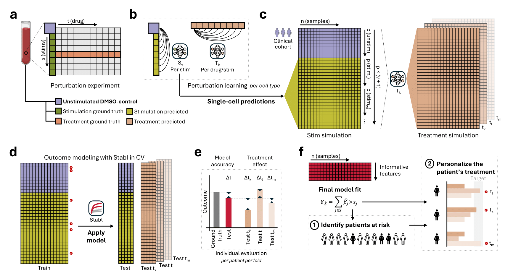

# [Single-cell simulation modeling of immunomodulatory drug interventions in pregnancy]

**Authors**: Jakob Einhaus\*, Peter Neidlinger\*, Olivier Fondeur\*, Masaki Sato\*, Brice Gaudilliere

# PTB Drug Response Prediction

We present SIMCO, a prediction ensemble that integrates outcome modeling with treatment effect estimation on simulated single-cell data to efficiently evaluate multiple drug candidates for their potential to delay labor and prevent preterm birth (PTB).

We first trained **CellOT**, a neural optimal transport (OT) model, to learn cell-type-specific perturbation responses across 28 immune cell populations. Next, we trained a **Stabl** model to identify a sparse set of features that accurately predict time to labor for each sample. Finally, we applied the trained models to simulated treatment effects in order to quantify each drug's impact on labor timing. By simulating drug responses at the single-cell level, our framework enables personalized evaluation of candidate therapies for PTB prevention.

<p align='center'> </p>

> *Figure: Overview of the modeling pipeline. CellOT learns perturbation effects at the single-cell level, which are then passed to Stabl to predict time to labor. Simulated drug responses enable individual-level treatment evaluation.*

## Repository contents

- `Cellot/`: Scripts and utilities to train and apply the CellOT model for single-cell perturbation modeling.
- `Stabl/`: Stabl package scripts.
- `Stabl_Launch/`: Scripts to train Stabl models for outcome prediction and treatment effect evaluation.

## Installation

To setup the corresponding virtual environment run:
```
python3.9 -m venv SIMCO_venv
source SIMCO_venv/bin/activate
pip install --upgrade pip
pip install setuptools==49.6.0
```
Install requirements and dependencies via:
```
pip install -r Requirements/Common_requirements.txt
```
Package requirements and dependencies for CellOT and Stabl are listed in `Requirements`. Installation takes < 5 minutes and has been tested on Sherlock (CentOS Linux 7 Core environment) and macOS (Version 15.5, with Apple M4).

## Datasets
You can download the preprocessed data [here]().

## Experiments

The CellOT models can be trained for each stim-cell type combination using the scripts in CellOT/sbatch_files such as ```train_cellot_cellwise_cv.sh```.

For example, to run CellOT on the ptb data for PI stimulation on cMCs using the healthy patients DMSO samples the script would be:

```
python ../cellot/scripts/train.py \
      --config ../configs/models/cellot.yaml \
      --config ../configs/tasks/ptb_final_cv_original/HV/ptb_PI_cMCs_HV_train.yaml \
      --outdir ../results/cross_validation_original/PI/cMCs/model-PI_cMCs \
      --config.data.target PI \
      --config.data.drug_used DMSO
```

The Stabl models can be trained using the scripts in Stabl_Launch/Bash_Files such as batch_stabl model.sh. The other .sh files launch a cross-validation on features already selected to perform a grid-search on XGBoost hyperparameters (e.g. ```batch_gridsearch.sh```) or to compare the time to labour prediction for each drug treated data (e.g. ```run_drug_comparison.sh```).

To run a Stabl model on predicted perturbation and unstim data, for a knockoff artificial type and an xgboost final model, the script would be:
```
python ../run_regression_cv.py \
    --features_path ../Data/ina_13OG_final_long_allstims_filtered.csv \
    --results_dir ../Results/run_stabl_XGB_KO_ptb_data \
    --artificial_type knockoff \
    --model_chosen xgboost
```
which corresponds to running :
```
bash batch_stablmodel.sh
```
The final models available are linear regression, XGBoost and Random Forest, with XGBoost giving the best results.

## Citation

In case you found our work useful, please consider citing us:
```
```

## Acknowledgements and Licenses

This repository includes code adapted from the following projects:

- **[CellOT](https://github.com/ratschlab/cellot)**, licensed under the BSD 3-Clause License.  
  If you use this code, please cite:  
  > Bunne, Charlotte et al. *Learning single-cell perturbation responses using neural optimal transport*. **Nature Methods**, 2023. [https://doi.org/10.1038/s41592-023-02064-x](https://doi.org/10.1038/s41592-023-02064-x)

- **[STABL](https://github.com/Gaudiss/Stabl)**, licensed under the BSD-3-Clause-Clear License.  
  If you use this code, please cite:  
  > Hédou, J., Marić, I., Bellan, G. et al. *Discovery of sparse, reliable omic biomarkers with Stabl*. **Nature Biotechnology**, 2024. [https://doi.org/10.1038/s41587-023-02033-x](https://doi.org/10.1038/s41587-023-02033-x)

For more details, see the `LICENSE` files in [`CellOT/`](./CellOT/LICENSE) and [`Stabl/`](./Stabl/LICENSE).


## Contact
In case you have questions, please contact us via email: jeinhaus@stanford.edu, ofondeur@stanford.edu, or gbrice@stanford.edu.
